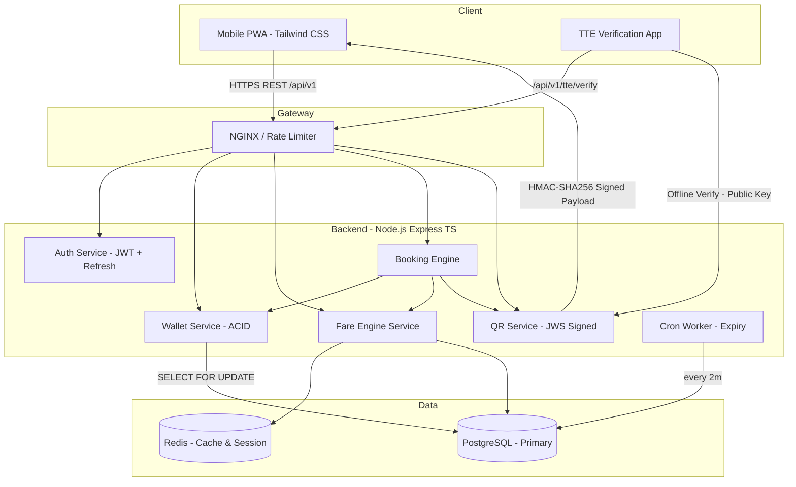

# Architecture & Database Schema

## Mermaid System Diagram

```mermaid
graph TB
    subgraph Client
        PWA[Mobile PWA - Tailwind CSS]
        TTE[TTE Verification App]
    end
    subgraph Gateway
        NGINX[NGINX / Rate Limiter]
    end
    subgraph Backend[Backend - Node.js Express TS]
        AUTH[Auth Service - JWT + Refresh]
        WALLET[Wallet Service - ACID]
        FARE[Fare Engine Service]
        BOOKING[Booking Engine]
        QR[QR Service - JWS Signed]
        CRON[Cron Worker - Expiry]
    end
    subgraph Data
        PG[(PostgreSQL - Primary)]
        REDIS[(Redis - Cache & Session)]
    end
    PWA -->|HTTPS REST /api/v1| NGINX
    TTE -->|/api/v1/tte/verify| NGINX
    NGINX --> AUTH & WALLET & FARE & BOOKING & QR
    WALLET -->|SELECT FOR UPDATE| PG
    FARE --> REDIS
    FARE --> PG
    BOOKING --> WALLET
    BOOKING --> FARE
    BOOKING --> QR
    QR -->|HMAC-SHA256 Signed Payload| PWA
    TTE -->|Offline Verify - Public Key| QR
    CRON -->|every 2m| PG
```
